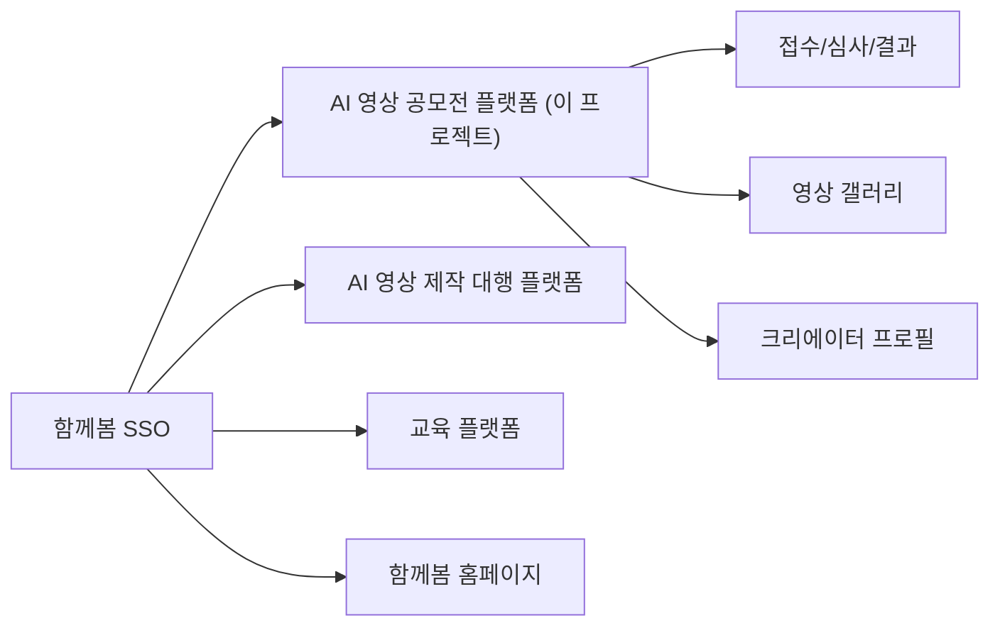

# VISION — 함께봄 AI 영상 공모전 플랫폼 (꿈플 / AI꿈)

> **마지막 갱신**: 2026-07-30
> **출처**: 2026-02-19 작성된 기획 문서 25종(커밋 `dcfecf7`, 2026-03-05 삭제)에서 현재도 유효한 내용을 승계하고, 이후 실제 운영 궤적을 반영해 재작성함.

## 1. 한 줄 정의

AI 영상 공모전의 **접수 → 심사 → 결과 → 갤러리** 전 과정을 하나의 경험으로 통합해, 주최자의 운영 효율과 참가자의 참여 전환을 동시에 높이는 플랫폼.

- 운영 도메인: https://www.aikkumhub.com
- 브랜드: 꿈플(kkumple) / AI꿈 — 운영 주체: **함께봄**

## 2. 함께봄 생태계에서의 위치

원래 구상(2026-02)은 함께봄 SSO를 허브로 한 4개 서비스 생태계였다:

| 영역 | 역할 | 현재 상태 (2026-07) |
|------|------|---------------------|
| **공모전 플랫폼** | 핵심 트래픽 / 참여 전환 | ✅ **실운영 중** — 유일하게 실체가 있는 축 |
| 대행 플랫폼 | 수익 확장 (연결 수수료) | ⏸️ 미착수 — 접수 폼(`agency_requests`)만 존재 |
| 교육 플랫폼 | 리텐션 / 역량 강화 | ⏸️ 미착수 |
| 홈페이지 | 브랜드 유입 허브 | 별도 운영 |

## 3. 전략의 변천 (중요)

| 시기 | 전략 |
|------|------|
| 2026-02 (기획) | 범용 멀티테넌트 공모전 **SaaS** — 누구나 주최자가 되는 플랫폼 + 구독 과금 |
| 2026-02-23 (피벗) | **직접 운영으로 선회** — "제1회 꿈꾸는 아리랑 AI 영상 공모전"을 자체 주최하며 플랫폼을 실전 검증 ([DECISIONS.md](DECISIONS.md) D-002) |
| 2026-04 (검증 완료) | 접수→심사→발표 1사이클 완주. 공모전 운영 코어는 검증됨 |
| 현재 | 유지보수 모드. 다음 방향(제2회 운영 / 수익화 / SaaS화)은 미결정 — [ROADMAP.md](ROADMAP.md) 참조 |

## 4. 타겟 사용자

| 사용자군 | 핵심 니즈 | 주요 행동 |
|----------|-----------|-----------|
| 참가자 | 간편 출품, 성과 확인, 노출 확대 | 공모전 탐색, 출품, 갤러리 활동 |
| 주최자 | 접수/심사 자동화, 운영 가시성 | 공모전 생성, 심사 운영, 결과 공지 |
| 심사위원 | 평가 효율, 진행률 확인 | 채점, 코멘트, 심사 완료 |
| 관리자 | 플랫폼 운영 통제, 정책 관리 | 회원/콘텐츠/운영 데이터 관리 |
| 게스트 | 서비스 탐색 | 공개 공모전/갤러리 열람 → 가입 전환 |

역할은 `profiles.roles` 배열로 복수 보유 가능하며, admin은 전체 접근 권한을 가진다.

## 5. 수익 모델 (설계됨, 전체 동결 상태)

기획상 수익 축 3개 — 모두 Phase 2+ 로 보류 중 ([ROADMAP.md](ROADMAP.md) 참조):

1. **구독 요금제** — 무료 / 스탠다드(월 9,900원) / 프리미엄(월 29,900원). 역할별 분석 기능 단계 과금. 코드상 `config/constants.ts`의 `DEFAULT_FEATURE_ACCESS`와 `pricing_plans` 테이블로 골격만 존재. 가격표 페이지는 "서비스 준비 중" 노출.
2. **운영 부가 기능** — 주최자 고급 리포트/자동화 옵션.
3. **외부 대행 연계** — 제작 대행 플랫폼 연결 수수료. 별도 도메인/레포로 운영하고 이 플랫폼은 연결 허브 역할 (영상 원본 복사 없이 메타데이터 참조).

## 6. 관련 문서

- [ROADMAP.md](ROADMAP.md) — 무엇을 언제 (상태별 로드맵)
- [FEATURES.md](FEATURES.md) — 무엇이 구현되어 있나 (기능 인벤토리)
- [DECISIONS.md](DECISIONS.md) — 왜 그렇게 했나 (결정 기록)
- [../AGENTS.md](../AGENTS.md) — 코드가 어떻게 생겼나 (개발자/에이전트용 코드 지도)
